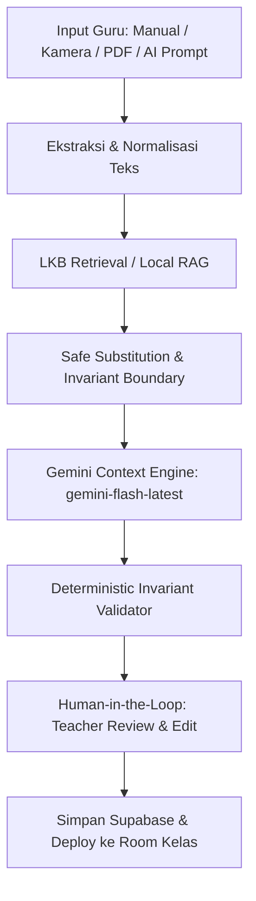

# Arsitektur AI & RAG Kontekstual DEPASKAN

> **Prinsip Utama:** *"Konteks Berubah, Kompetensi Tetap"*  
> AI berwenang mengadaptasi latar, tokoh, komoditas, lokasi, dan situasi agar relevan dengan kearifan lokal siswa (fokus: SD Kelas V, Ponorogo & Keresidenan Madiun). Namun AI **dilarang keras** mengubah kompetensi dasar, maksud soal, struktur logika, angka perhitungan matematika, atau kunci jawaban.

---

## 1. Alur Pipeline 8 Tahap (End-to-End Pipeline)



### Tahap 1: Input Ingestion
Guru memilih salah satu dari 4 metode input:
- **Ketik Manual:** Guru memasukkan draf materi/soal sendiri.
- **Buka Kamera (Laptop/HP):** Pemotretan naskah fisik dari buku paket/LKS secara langsung.
- **Upload Berkas Gambar / PDF:** Unggah berkas dokumen soal atau modul format PDF/gambar.
- **Generate AI Murni:** Memberikan topik umum (contoh: *Operasi Hitung Pecahan di Pasar Tradisional*).

### Tahap 2: Ekstraksi & Normalisasi Naskah
- Endpoint: `/api/ai/extract`
- File multimodal dikirimkan ke model Gemini dengan prompt ekstraksi OCR ketat.
- **Pembersihan Tanpa Mock:** Tidak ada mock template; jika berkas rusak atau teks kosong, sistem mengembalikan pesan galat transparan sehingga guru dapat memperbaiki foto/dokumen.

### Tahap 3: LKB Retrieval (Local Knowledge Base RAG)
- Modul: `lib/rag/lkb-retriever.ts`
- Data terverifikasi: 20+ entitas kearifan lokal Jawa Timur (Ponorogo, Madiun, Magetan, Ngawi, Pacitan).
- Contoh entitas Ponorogo: *Pasar Legi Ponorogo (pasar induk komoditas), Beras Organik Sooko, Dawet Jabung Bu Jemirah, Reog Ponorogo, Jeruk Keprok Pulung, Sentra Gerabah Balong*.
- Retrieval menggabungkan pencarian berbasis wilayah (`region_id` / `region_name`) dan pencarian semantik topik pembelajaran.

### Tahap 4: Safe Substitution & Invariant Boundary
- Sebelum prompt dikirim ke engine generatif, sistem mengekstrak:
  - **Angka Matematika:** Bilangan bulat, pecahan, desimal, dan harga mata uang (contoh: 24, 15.000, 4, 100.000).
  - **Kunci Jawaban:** Posisi opsi benar (A, B, C, D) dan maksud soal.
- Prompt menginstruksikan LLM untuk mengembalikan pemetaan variabel kontekstual (`context_variables`):
  ```json
  {
    "original_term": "toko buah serba ada",
    "replacement_term": "Pasar Legi Ponorogo",
    "category": "location",
    "reason": "Pasar induk terbesar di Ponorogo tempat transaksi jual beli nyata"
  }
  ```

### Tahap 5: Gemini Context Engine & Model Routing
- Modul: `lib/ai/ai-provider-manager.ts` & `lib/ai/gemini-provider.ts`
- **Routing Hierarkis Berjenjang:**
  1. **Primary Model:** `gemini-flash-latest` (model resmi aktif, latensi rendah, kuota stabil).
  2. **Fallback Model:** `gemini-3.7-flash` (model generasi terbaru dengan kemampuan penalaran tinggi).
  3. **Backup Model:** `gemini-3.8-flash` (model cadangan dengan penanganan error 503/429 berbasis *exponential backoff*).
- Menghasilkan format JSON terstruktur (`responseMimeType: "application/json"`).

### Tahap 6: Deterministic Invariant Validator
- Modul: Validasi deterministik di `/api/ai/contextualize`
- **Aturan Validasi Keras:**
  - `math_numbers_strictly_preserved`: Seluruh angka yang ada pada naskah asli wajib tetap ada pada naskah hasil transformasi.
  - `answer_key_preserved`: Kunci jawaban tetap konsisten pada konsep yang sama.
  - `local_context_grounded`: Memastikan entitas lokal dari wilayah yang dipilih benar-benar termuat dalam narasi.
  - Menghasilkan status: `VALID`, `WARNING`, atau `INVALID` beserta catatan peringatan terperinci.

### Tahap 7: Human-in-the-Loop Review (Tinjauan Guru)
- Tampilan di `app/teacher/questions/page.tsx` dan `app/teacher/materials/page.tsx`:
  - **Side-by-Side Comparison:** Naskah Asli/Standar vs Naskah Kontekstual Lokal.
  - **Badge Variabel Konteks:** Tag visual substitusi istilah lokal (`original_term ➔ replacement_term`).
  - **Checklist Validasi Pedagogis:** Indikator visual keutuhan kompetensi, konsistensi kunci jawaban, dan keutuhan angka matematika.
  - **Editor Interaktif:** Guru memiliki kendali 100% untuk menyunting stimulus, pilihan opsi, kunci jawaban, dan pembahasan sebelum menyimpan.

### Tahap 8: Sinkronisasi Multi-Device & Penyebaran Room
- Modul: `lib/db/repository.ts`
- **Offline-First & Cloud Sync:** Data tersimpan lokal di browser (`localStorage`) dan disinkronkan otomatis ke tabel Supabase `user_synced_data`.
- **Identitas Akun Bersatu:** Menggunakan `auth.uid()` Supabase sebagai `teacher_id` utama sehingga data tersinkronisasi instan antara laptop dan ponsel.
- Guru dapat mempublikasikan materi atau soal ke dalam **Room Kelas Siswa** secara langsung dengan kode akses unik 4-6 digit.

---

## 2. Parameter & Skema Data API Kontekstualisasi

### Request Payload (`POST /api/ai/contextualize`)
```json
{
  "type": "question" | "material",
  "inputMode": "manual" | "camera" | "pdf" | "ai",
  "prompt": "Topik atau instruksi tambahan",
  "rawText": "Naskah soal atau materi sumber",
  "topic": "Operasi Hitung Belanja",
  "subject": "Matematika",
  "grade": 5,
  "regionId": "35.02",
  "regionName": "Kabupaten Ponorogo"
}
```

### Response Payload (`POST /api/ai/contextualize`)
```json
{
  "success": true,
  "data": {
    "topic": "Operasi Hitung Belanja di Pasar Legi Ponorogo",
    "questions": [
      {
        "id": "q-item-1790525-1",
        "original_question_text": "Ibu membeli 24 kg beras di toko dengan harga...",
        "question_text": "Ibu berbelanja di Pasar Legi Ponorogo membeli 24 kg beras organik Sooko...",
        "type": "multiple_choice",
        "options": [
          { "key": "A", "text": "Rp60.000,00" },
          { "key": "B", "text": "Rp75.000,00" },
          { "key": "C", "text": "Rp80.000,00" },
          { "key": "D", "text": "Rp90.000,00" }
        ],
        "correct_answer": "A",
        "explanation": "Harga 4 kg beras = 4 x Rp15.000 = Rp60.000...",
        "context_variables": [
          {
            "original_term": "toko sembako",
            "replacement_term": "Pasar Legi Ponorogo",
            "category": "location",
            "reason": "Pasar induk transaksi komoditas di Ponorogo"
          }
        ],
        "validation": {
          "is_valid": true,
          "status": "VALID",
          "competency_preserved": true,
          "answer_key_preserved": true,
          "math_numbers_strictly_preserved": true,
          "local_context_grounded": true,
          "warnings": []
        }
      }
    ],
    "validation": {
      "is_valid": true,
      "status": "VALID",
      "competency_preserved": true,
      "local_context_grounded": true,
      "math_numbers_strictly_preserved": true
    }
  },
  "modelUsed": "gemini-flash-latest"
}
```
