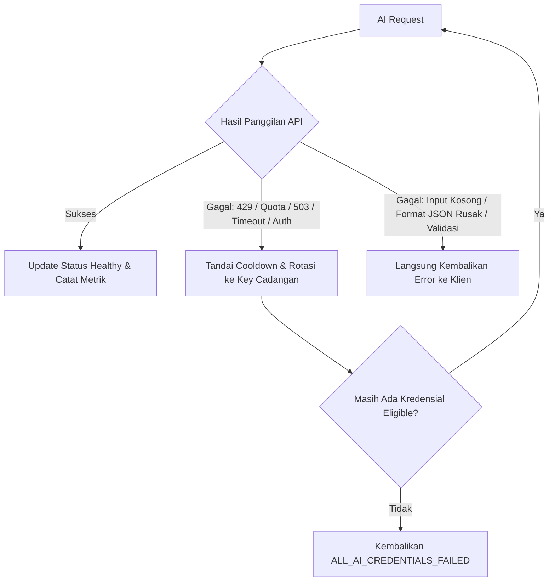

# ARSITEKTUR AI CREDENTIAL POOL & FAILOVER CASCADE (AI_FALLBACK.md)

**Repositori:** DEPASKAN (ContextLearningApp)  
**Komponen:** `lib/ai/ai-provider-manager.ts` & `lib/admin/admin-repository.ts`  

---

## 1. POOL KREDENSIAL ADMIN (5 API KEYS)

Admin DEPASKAN mengelola 5 slot API key Gemini:
- **Priority 1 (Primary):** Kunci utama untuk pemrosesan reguler.
- **Priority 2 - 5 (Backups):** Kunci cadangan berurutan saat terjadi kegagalan transient.

Setiap kredensial menyimpan metadata kesehatan:
- `priority`: urutan seleksi (1 = prioritas tertinggi).
- `is_enabled`: switch aktif/nonaktif dari dashboard admin.
- `health_status`: `healthy` | `degraded` | `rate_limited` | `invalid` | `disabled`.
- `circuit_state`: `CLOSED` (normal), `OPEN` (diblokir sementara), `HALF_OPEN` (uji coba).
- `cooldown_until`: timestamp ISO kapan kunci boleh dicoba kembali (default cooldown 5 menit untuk rate limit / kuota).
- `failure_count` & `success_count`: metrik keandalan per kredensial.
- `quota_group`: penanda grup kuota untuk mencegah rotasi sia-sia jika 2 key berada di Google Cloud Project yang sama.

---

## 2. ATURAN FALLBACK & KLASIFIKASI ERROR

Tidak semua error memicu rotasi API key. Sistem menggunakan **Klasifikasi Error Provider-Aware**:

### Matriks Aksi Berdasarkan Tipe Error:

1. **Transient Provider Failures (Rotasi Berjalan):**
   - HTTP 429 / `RESOURCE_EXHAUSTED` / `rate limit`: Kunci diberi cooldown 5 menit, log `AI_FALLBACK_TRIGGERED`, request dicoba ke kunci urutan berikutnya.
   - HTTP 503 / `SERVICE_UNAVAILABLE` / `overloaded`: Kunci diberi cooldown 2 menit, request dicoba ke kunci berikutnya.
   - Timeout / Network Fetch Error: Kunci dicatat mengalami transient issue, rotasi ke kunci berikutnya.
   - HTTP 401 / 403 / API Key Invalid: Kunci dinonaktifkan (`invalid`), langsung berpindah ke kunci cadangan.

2. **Non-Transient Client/Application Bugs (Rotasi DILARANG):**
   - Input kosong (`INPUT_INVALID`): Langsung gagal, tidak membakar sisa API key di pool.
   - Invalid JSON response: Langsung return `AI_INVALID_RESPONSE`.
   - Content policy / safety filter: Langsung return keterangan keamanan.

---

## 3. AUDIT OBSERVABILITY & LOGGING

Setiap interaksi AI mencatat event audit tanpa mengekspos kunci asli:
- Format Request ID: `DEP-YYYYMMDD-XXXXXX`
- Event Type:
  - `AI_REQUEST_STARTED` (model, target wilayah, jenis konten)
  - `AI_FALLBACK_TRIGGERED` (from_cred -> to_cred, alasan failover)
  - `AI_REQUEST_SUCCESS` (durasi milidetik, model digunakan)
  - `AI_REQUEST_FAILED` (kode error terstruktur)
  - `AI_ALL_CREDENTIALS_FAILED` (semua 5 kunci tidak tersedia)

Log audit dapat dipantau langsung oleh Administrator melalui antarmuka `/admin/ai/usage` dan `/admin/security/audit-logs`.
