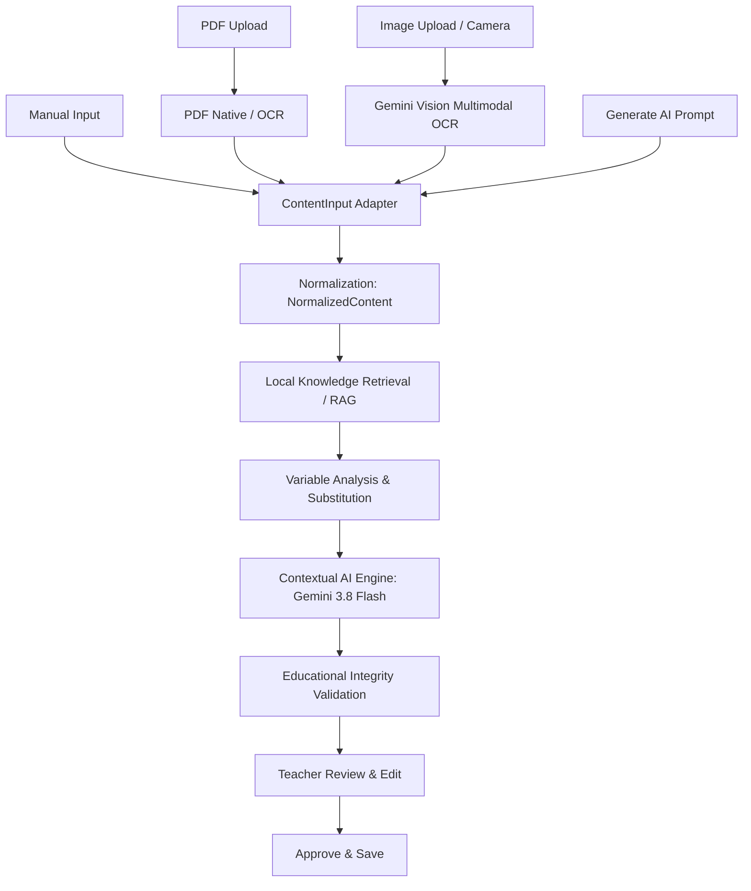

# DOKUMENTASI PIPELINE INPUT & KONTEKSTUALISASI (AI_INPUT_PIPELINE.md)

**Repositori:** DEPASKAN (ContextLearningApp)  
**Versi:** 2.0 (Unified Shared Pipeline Architecture)  

---

## 1. CORE PRINCIPLE

> **"Konteks berubah, kompetensi tetap."**

DEPASKAN menyediakan 4 metode input baik untuk **Materi Pembelajaran** maupun **Butir Soal Evaluasi**:
1. **Manual:** Guru mengetik langsung materi atau soal.
2. **PDF:** Berkas PDF baik berupa dokumen teks digital maupun naskah hasil scan.
3. **Image / Foto / Scan:** Foto kamera atau berkas gambar lembar soal/buku teks.
4. **Generate AI:** Guru memasukkan instruksi atau topik pembelajaran.

Seluruh metode input di atas **TIDAK LAGI** memiliki pipeline terpisah. Semuanya bermuara pada satu pipeline kontekstualisasi terpadu (`ContextualAIEngine`).

---

## 2. ARSITEKTUR PIPELINE TERPADU

### Tahapan Pipeline:
1. **Input Adapter / Extraction:**
   - PDF diproses via `extractTextFromPdfBuffer` (`pdf-parse` v2). Jika berupa pindaian (teks < 20 karakter), diteruskan ke Multimodal Document OCR via Gemini Vision 3.8 Flash.
   - Gambar diproses langsung via Gemini Vision Multimodal OCR dengan prompt khusus Kurikulum Merdeka SD.
   - Hasil ekstraksi teks ditampilkan pada antarmuka guru agar guru dapat memeriksa dan menyunting naskah awal sebelum diproses AI.
2. **Normalization (`normalizeContent`):**
   - Menghasilkan objek standar `NormalizedContent` yang memuat `contentType`, `sourceType`, `effectiveText`, `subject`, `grade`, `regionId`, `regionName`, serta `options` dan `correctAnswer` (untuk soal).
3. **Local Knowledge Retrieval (RAG):**
   - Mengambil data entitas lokal dari basis pengetahuan (LKB) terverifikasi untuk wilayah target (Ponorogo, Madiun, Magetan, Ngawi, Semarang, dsb.).
4. **Contextualization:**
   - Menghubungkan narasi naskah dengan entitas lokal relevan (komoditas, budaya, mata pencaharian, letak geografis).
   - Melindungi **angka numerik** dan **operasi matematika** agar invarian hitungan tidak berubah sama sekali.
5. **Educational Integrity Validation:**
   - Memvalidasi kesetaraan angka matematis asli vs lokal, kelengkapan opsi pilihan ganda (A, B, C, D), dan konsistensi kunci jawaban.
6. **Teacher Review / Edit (Human-in-the-Loop):**
   - Guru meninjau hasil kontekstualisasi, membaca catatan pedagogis dan peringatan validasi, serta dapat melakukan pengeditan naskah secara bebas.
7. **Approve & Save:**
   - Konten disimpan ke repositori lokal dan disinkronkan ke cloud Supabase hanya setelah disetujui oleh guru.

---

## 3. MATRIKS 10 WORKFLOW

| No | Jenis Konten | Metode Input | Alur Pemrosesan |
|:---:|:---:|:---:|:---|
| 1 | Materi | Manual | Manual Text -> Normalization -> Local RAG -> Contextualization -> Validation -> Review -> Save |
| 2 | Materi | PDF Text | PDF Buffer -> Native Parser -> Normalization -> RAG -> Contextualization -> Validation -> Save |
| 3 | Materi | PDF Scan | PDF Buffer -> Gemini Vision OCR -> Normalization -> RAG -> Contextualization -> Save |
| 4 | Materi | Image / Foto | Image -> Gemini Vision OCR -> Normalization -> RAG -> Contextualization -> Save |
| 5 | Materi | Generate AI | Prompt -> Normalization -> Local RAG -> Generative Context Engine -> Save |
| 6 | Soal | Manual | Soal & Opsi -> Normalization -> Math Number Lock -> Contextualization -> Key Validation -> Save |
| 7 | Soal | PDF Text | PDF Soal -> Native Parser -> Normalization -> Math Number Lock -> Contextualization -> Save |
| 8 | Soal | PDF Scan | PDF Soal Scan -> Gemini Vision OCR -> Normalization -> Math Number Lock -> Contextualization -> Save |
| 9 | Soal | Image / Foto | Foto Soal -> Gemini Vision OCR -> Normalization -> Math Number Lock -> Contextualization -> Save |
| 10 | Soal | Generate AI | Prompt -> Generasi Soal + Invarian -> Validation -> Review -> Save |

Semua 10 alur diuji secara otomatis dan terverifikasi pada berkas `tests/unified-matrix-pipeline.test.ts`.
