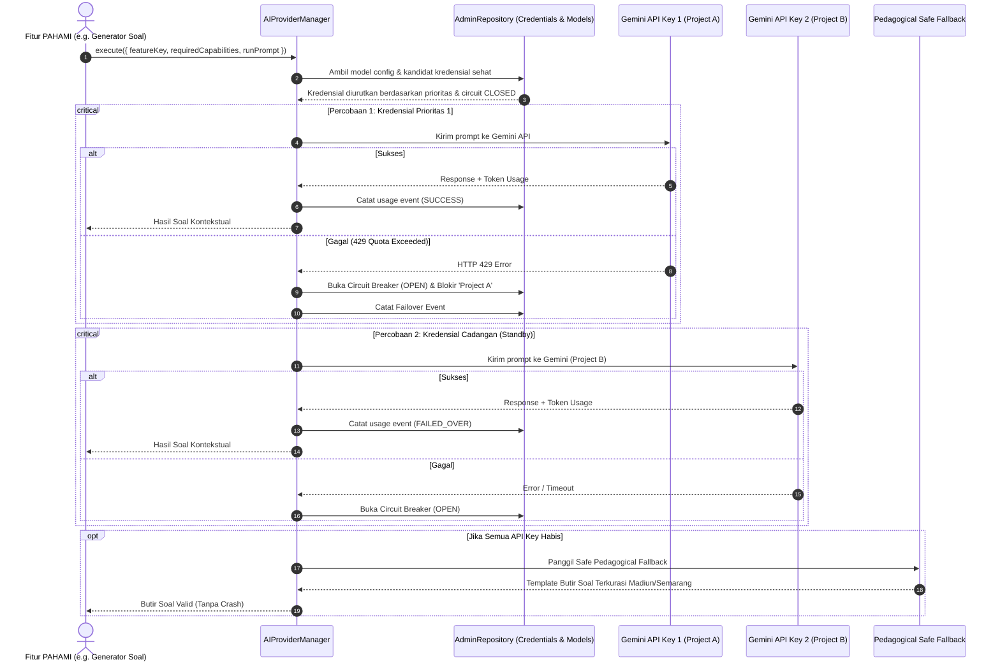

# DOKUMENTASI TEKNIS AI PROVIDER MANAGER — PAHAMI V2
**Hak Cipta © 2026 Tim PAHAMI — Hackathon IT Comp 2026**  
*AI Infrastructure Engineer, Senior Backend Engineer, DevOps Engineer*

---

## 1. PENDAHULUAN & MASALAH YANG DISELESAIKAN

Dalam aplikasi pendidikan berbasis AI generatif, mengandalkan satu API key tunggal berisiko tinggi mengalami kegagalan fatal saat:
1. **Batas Kuota Tercapai (HTTP 429 Quota Exceeded)**: Kuota harian atau menit pada Google AI Studio habis.
2. **Server Provider Overloaded (HTTP 503)**: Google Gemini mengalami lonjakan beban sesaat.
3. **Rotasi Sia-Sia**: Sistem merotasi ke API key lain yang sebenarnya berasal dari Google Cloud Project yang sama sehingga tetap gagal.
4. **Crash saat Penjurian**: Aplikasi menampilkan pesan error teknis ke siswa atau dewan juri ketika semua API key offline.

**AI Provider Manager** (`lib/ai/ai-provider-manager.ts`) diciptakan untuk menyelesaikan seluruh permasalahan tersebut secara otomatis dan deterministik.

---

## 2. ARSITEKTUR KELAS & PIPELINE EKSEKUSI



---

## 3. KLASIFIKASI ERROR (ERROR TAXONOMY)

Metode `classifyError(err: any): AIErrorClassification` mendeteksi jenis kegagalan secara granular:

| HTTP / Error Code | Klasifikasi Tipe | Tindakan Engine |
| :--- | :--- | :--- |
| `429`, `RESOURCE_EXHAUSTED` | `QUOTA_EXCEEDED` | Trip circuit breaker ke `OPEN`, kecualikan seluruh `quota_group` terkait, segera rotasi ke provider lain. |
| `429`, `RATE_LIMIT_EXCEEDED` | `RATE_LIMITED` | Rotasi ke kredensial cadangan; beri cooldown 60 detik. |
| `503`, `UNAVAILABLE` | `OVERLOADED` | Tambah `consecutive_errors`. Jika mencapai threshold 3, buka circuit breaker. |
| `ETIMEDOUT`, `TIMEOUT` | `TIMEOUT` | Buka circuit breaker dan rotasi ke model dengan batas timeout lebih longgar. |
| `400`, `INVALID_ARGUMENT` | `BAD_REQUEST` | Tidak membuka circuit breaker (kesalahan pada prompt/skema input). |
| `403`, `PERMISSION_DENIED` | `AUTH_FAILED` | Tandai kredensial sebagai `offline` secara permanen hingga admin memperbarui key. |

---

## 4. SISTEM CIRCUIT BREAKER MANDIRI

Parameter konfigurasi circuit breaker:
- **Threshold Kesalahan Beruntun**: 3 kali berturut-turut.
- **Waktu Cooldown**: 60 detik sebelum berpindah ke `HALF_OPEN`.
- **Reset Manual**: Dapat dilakukan kapan saja oleh developer melalui Admin Control Center di `/admin/ai/failover`.

### Kode Transisi Circuit Breaker
```typescript
if (classification.shouldTripCircuit) {
  const newConsecutive = cred.consecutive_errors + 1;
  const isTripped = newConsecutive >= 3 || classification.type === "QUOTA_EXCEEDED";

  adminRepository.updateCredential(cred.id, {
    consecutive_errors: newConsecutive,
    circuit_state: isTripped ? "OPEN" : "CLOSED",
    circuit_opened_at: isTripped ? new Date().toISOString() : null,
    health_status: isTripped ? "failing" : "degraded",
    last_error: classification.message,
    last_error_at: new Date().toISOString(),
  });
}
```

---

## 5. FITUR QUOTA-GROUP AWARENESS

Banyak organisasi memiliki beberapa API Key yang terhubung ke satu Project Google Cloud yang sama. Jika satu key terkena limit harian atau kredit habis, merotasi ke key lain di project yang sama adalah kesia-siaan (*wasted roundtrip*).

Di PAHAMI V2, setiap kredensial memiliki atribut `quota_group`. Ketika error `QUOTA_EXCEEDED` terjadi pada suatu kredensial:
1. `exhaustedQuotaGroups.add(cred.quota_group)` dicatat dalam memori eksekusi sesi.
2. Filter kandidat selanjutnya secara otomatis mengecualikan seluruh kredensial dengan `quota_group` yang sama.
3. Eksekusi langsung berpindah ke akun Google Cloud cadangan yang independen.

---

## 6. JAMINAN ZERO CRASH: PEDAGOGICAL SAFE FALLBACK

Jika seluruh koneksi internet atau kuota API Gemini offline, `AIProviderManager` tidak pernah melemparkan error fatal yang merusak antarmuka pengguna:
- Fitur pembuatan soal secara mulus menyajikan butir soal kurikuler terverifikasi dari dataset lokal (misal: perhitungan daya tampung Waduk Bening Widas atau sejarah PT INKA Madiun).
- Nilai dan format JSON sesuai dengan skema yang diharapkan frontend.
- Log telemetri mencatat status sebagai `SAFE_FALLBACK` untuk audit administrator.

---

## 7. CONTOH INTEGRASI KODE

Untuk memanggil AI Gemini melalui engine failover di fitur apa pun:

```typescript
import { aiProviderManager } from "@/lib/ai/ai-provider-manager";

const result = await aiProviderManager.execute({
  featureKey: "question_generation",
  requiredCapabilities: ["text_generation", "structured_output"],
  callerUserId: "usr-teacher-01",
  runPrompt: async ({ apiKey, model, temperature, timeoutMs, maxOutputTokens }) => {
    // Jalankan pemanggilan Gemini SDK menggunakan apiKey dan model terpilih
    const response = await callGeminiWithKey({ apiKey, model, promptText });
    return {
      output: response.data,
      inputTokens: response.usage.promptTokens,
      outputTokens: response.usage.candidatesTokens,
    };
  },
  safeFallback: () => {
    // Return kurikuler fallback jika seluruh provider offline
    return getPrecompiledCurricularQuestion();
  },
});
```
