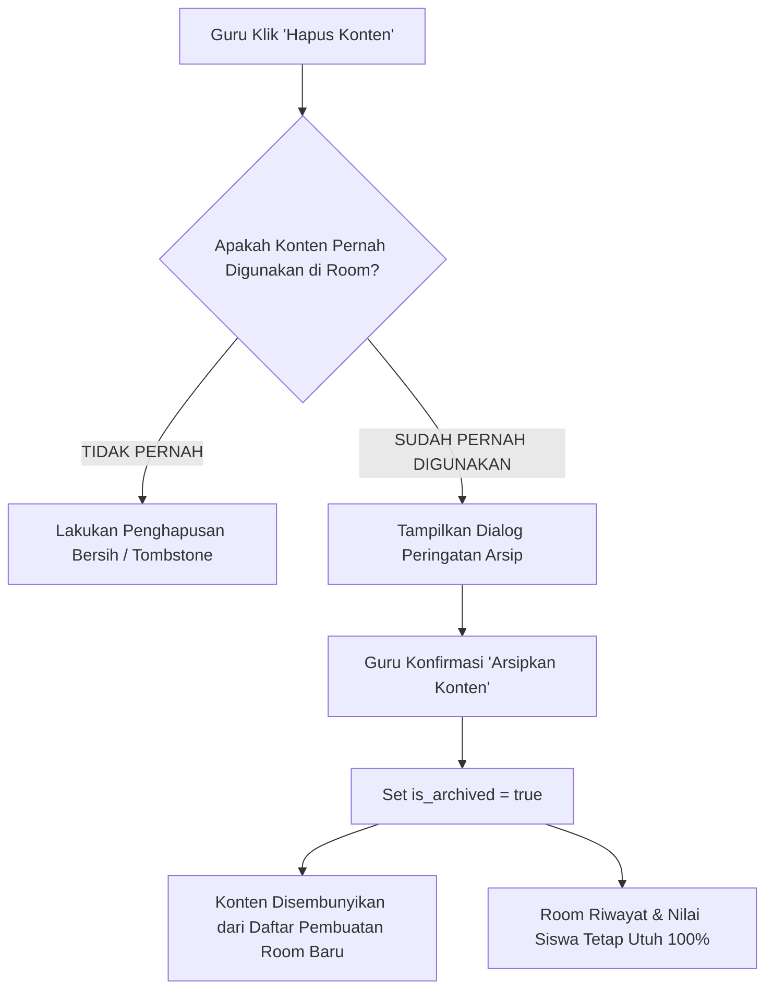

# SIKLUS HIDUP KONTEN, ROOM & SNAPSHOT IMMUTABILITY (CONTENT_ROOM_LIFECYCLE.md)

**Repositori:** DEPASKAN (ContextLearningApp)  
**Komponen:** `lib/db/repository.ts`, `app/api/room/[code]/route.ts`, `app/room/[code]/page.tsx`  

---

## 1. MASALAH ARSITEKTURAL HISTORIS

Pada sistem lama, ketika seorang guru menghapus materi atau bank soal dari Dashboard Guru (`/teacher/materials` atau `/teacher/questions`), tindakan tersebut mengeksekusi penghapusan fisik (physical delete). Jika konten tersebut sedang atau pernah digunakan dalam Room kelas:
- Room aktif menjadi rusak (halaman Room siswa gagal memuat materi atau butir soal).
- Riwayat hasil ujian siswa (`RoomSubmission` / `student_scores`) kehilangan referensi soal dan opsi jawaban yang dikerjakan siswa.
- Dashboard guru menampilkan error foreign key atau missing resource.

---

## 2. SOLUSI: ROOM SNAPSHOT & SOFT-ARCHIVE LIFECYCLE

Sistem DEPASKAN menerapkan dua pilar proteksi integritas data:

### A. Room Snapshot Immutability
Saat Room dibuat melalui `repository.createRoom`:
1. Sistem mengambil data materi utuh dan menyimpannya ke kolom `material_snapshot`.
2. Sistem mengambil seluruh butir soal, opsi (A, B, C, D), kunci jawaban, dan pembahasan ke kolom `question_snapshot`.
3. Siswa yang mengakses `/room/[code]` membaca naskah dari **snapshot terlebih dahulu**.
4. Jika guru di kemudian hari mengedit atau memperbarui naskah materi di Dashboard, naskah Room yang sedang berjalan atau yang sudah selesai **tetap menggunakan versi snapshot**, sehingga hasil ujian siswa tidak akan pernah berubah atau rusak.

### B. Safe Archiving vs Physical Delete
Sebelum menghapus konten, sistem memanggil `repository.isContentUsedInRoom(type, contentId)`:

### Penjelasan Dialog Konfirmasi Guru:
Jika konten sudah terikat dengan Room, modal konfirmasi menampilkan penjelasan transparan:
> *"Konten ini sudah digunakan dalam Room.*  
> *Untuk menjaga data Room dan hasil siswa tetap aman dan dapat diakses, konten akan diarsipkan dan tidak digunakan untuk pembuatan Room baru."*  
> Action: **[Batal]** | **[Arsipkan Konten]**

---

## 3. PENGUJIAN OTOMATIS LIFECYCLE

Integritas siklus hidup konten diuji secara otomatis pada:
- `tests/room-lifecycle-snapshot.test.ts`: Memvalidasi pembuatan snapshot otomatis saat Room dibuat, ketahanan Room saat resource diarsipkan, dan immutability naskah terhadap pengeditan baru.
- `tests/deletion-tombstone.test.ts`: Memvalidasi pembuatan tombstone agar item yang dihapus tidak bangkit kembali (anti-resurrection) saat sinkronisasi cloud multi-perangkat.
