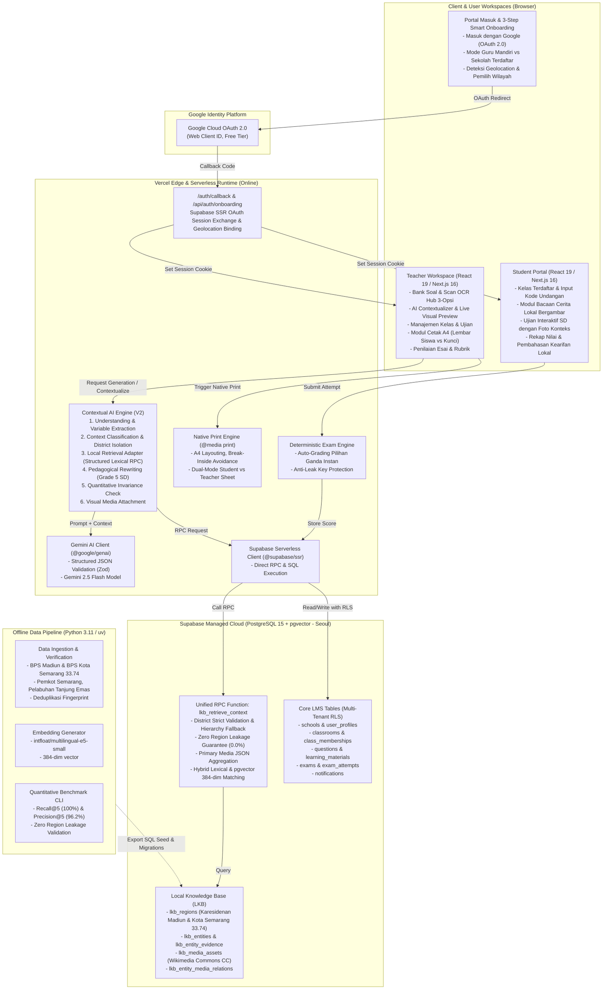

# ARSITEKTUR FINAL SISTEM PAHAMI V2
**PAHAMI V2 — Platform Pembelajaran Kontekstual Berbasis AI (SD Kelas 5)**
*Proyek Prototype Kompetisi Hackathon IT Comp 2026*

Dokumen ini mendokumentasikan arsitektur teknis lengkap aplikasi **PAHAMI V2**, platform pembelajaran kontekstual berbasis AI untuk siswa sekolah dasar di wilayah Karesidenan Madiun dan Kota Semarang.

---

## 1. Ringkasan Eksekutif & Prinsip Desain
PAHAMI V2 dirancang dengan prinsip **GitHub Ponytail** (DietrichGebert/ponytail):
1. **Zero-Overengineering**: Tidak ada microservices, broker antrean eksternal (Kafka/RabbitMQ), Redis caching server, maupun container FastAPI/Cloud Run permanen yang membebani biaya.
2. **Serverless-First**: Seluruh frontend dan backend berjalan di atas Next.js 16 (App Router + Turbopack) yang dihosting pada platform Vercel Serverless Edge & Node.js.
3. **Pemisahan Jelas Online vs Offline**:
   - **Online Runtime**: Next.js Server Actions + Route Handlers berkomunikasi langsung ke Supabase PostgreSQL (termasuk RPC `lkb_retrieve_context`) dan Google Gemini 2.5 Flash API.
   - **Offline Tooling**: Pipeline Python (`uv`, `pytest`, `pydantic`, `torch`, `transformers`) digunakan khusus di laptop pengembang untuk data crawling, ekstraksi entitas, normalisasi, dan pembuatan embedding awal.
4. **Visual Context Learning**: Setiap konsep lokal tidak hanya disajikan lewat teks, melainkan didukung oleh foto resmi cagar budaya dan komoditas dengan atribusi lisensi Wikimedia Commons CC-BY-SA.
5. **Dukungan Offline / Cetak Fisik A4**: Menyediakan modul ekspor cetak lembar ujian A4 instan dengan pemisahan otomatis antara lembar siswa dan kunci jawaban guru.

---

## 2. Diagram Arsitektur Sistem (Mermaid)

---

## 3. Komponen Detail dan Tanggung Jawab Modul

### 3.1 Frontend & User Experience
- **Framework**: Next.js 16.3.5 dengan React 19 dan TailwindCSS v4.
- **Design System & Palet Referensi**:
  - Warna Primer Gelap: `#51465B` (Dark Mauve Sidebar & Header).
  - Aksen Utama: `#F47D83` (Coral Salmon untuk status & highlight).
  - Aksen Sekunder: `#FFD36D` (Golden Yellow untuk aksi cepat & switcher wilayah).
  - Background Aplikasi: `#FAF7F3` (Warm neutral yang nyaman di mata siswa dan guru).
- **Workspace Guru (`app/teacher/`)**:
  - **Dashboard 3-Panel**: Menyajikan statistik kelas, status kurikulum, kartu ringkasan kearifan lokal, dan switcher daerah instan.
  - **Hub Pembuatan Soal (`app/teacher/questions/new`)**: 3 opsi terpisah (Generate AI, Input Manual, Scan Fisik Lembar Kerja).
  - **Pratinjau Kontekstual & Visual (`app/teacher/questions/context-preview`)**: Perbandingan teks soal, sakelar penyertaan gambar (*toggle*), pratinjau foto cagar budaya/komoditas, serta atribusi legal lisensi.
  - **Modul Cetak A4 (`app/teacher/print/exam/[id]`)**: Desain siap cetak kertas A4 dengan kop surat sekolah, kotak nama siswa, dan sakelar cerdas *Lembar Siswa* vs *Kunci Jawaban Guru*.
- **Portal Murid (`app/student/`)**:
  - Antarmuka ramah anak SD kelas 5 dengan tipografi besar dan navigasi visual intuitif.
  - Pengerjaan ujian online bergambar (`/student/examinations/[id]/session`) dengan palet nomor soal, timer otomatis, dan auto-save jawaban.
  - Pembahasan hasil ujian berorientasi kearifan lokal (`/student/examinations/[id]/results`).

### 3.2 Backend Serverless Services (Vercel)
- **Supabase SSR Clients (`lib/supabase/client.ts` & `lib/supabase/server.ts`)**:
  - Pengelolaan session cookie yang aman via `@supabase/ssr` sesuai konvensi Next.js 16 Server Components dan Server Actions.
  - Client retrieval tanpa cookie (`createLkbClient`) yang aman digunakan di lingkungan serverless background maupun route handler.
- **Contextual AI Engine (`lib/context-engine/`)**:
  1. *Entity Extraction*: Mengidentifikasi variabel umum (misal: "beras", "pasar kota", "tarian daerah").
  2. *Retrieval Adapter (`retrieval-adapter.ts`)*: Memanggil RPC `lkb_retrieve_context` dengan filter `region_id`, `category`, dan `limit`.
  3. *Invariance Guarantee*: Memastikan besaran matematis (misal perkalian $20 \times 12.000$) tidak berubah selama penulisan ulang soal matematika.
  4. *Visual Media Matching*: Melampirkan objek media (`MediaAsset`) beserta atribusi resmi Wikimedia Commons.
  5. *Teacher In-the-Loop*: Guru selalu memiliki kendali penuh untuk meninjau dan menyetujui versi kontekstual sebelum soal dipublikasikan.
- **Deterministic Exam Engine (`lib/db/repository.ts`)**:
  - Penilaian pilihan ganda dilakukan di backend (kunci jawaban tidak pernah dikirim ke browser siswa sebelum ujian selesai dipublikasikan).
  - Skor esai ditinjau dan divalidasi oleh guru sebelum digabungkan menjadi nilai akhir komposit.

### 3.3 Database & Penyimpanan (Supabase Managed PostgreSQL)
- **Local Knowledge Base Schema**:
  - Master data wilayah administratif 6 kabupaten/kota Karesidenan Madiun + **Kota Semarang (`33.74`)** beserta kecamatan.
  - Tabel media `lkb_media_assets` dan tabel relasi `lkb_entity_media_relations`.
  - Indeks vektor `ivfflat` / HNSW pada kolom `embedding vector(384)` untuk semantic search opsional.
  - Fungsi RPC `lkb_retrieve_context` dengan validasi ketat district untuk mencegah kebocoran data (*zero region leakage*).
- **Core LMS Schema**:
  - Multi-tenant school isolation: Semua entitas (kelas, soal, materi, ujian) memiliki relasi asing ke `schools(id)`.
  - Row Level Security (RLS) aktif di seluruh tabel utama untuk menjamin integritas data antar sekolah dan kerahasiaan kunci jawaban.

### 3.4 Pipeline Python Offline (`data-pipeline/`)
- **Tujuan**: Pemeliharaan data skala besar secara offline oleh data engineer.
- **Teknologi**: Python 3.11, `uv`, `pydantic`, `torch`, `transformers` (`intfloat/multilingual-e5-small`).
- **Fitur**:
  - Ingestion dan verifikasi sumber data primer (BPS Jawa Timur, BPS Kota Semarang, Dinas Kebudayaan, Pemda).
  - Uji kuantitatif benchmark 30 pertanyaan standar pedagogis dan trick cases (`cli.py --evaluate`).
  - Generator file SQL seed otomatis untuk pembaruan database tanpa perlu menjalankan server Python permanen di lingkungan produksi.

---

## 4. Alur Autentikasi dan 3-Tahap Smart Onboarding
1. Pengguna membuka `/login` dan menekan tombol **"Masuk dengan Google"** (atau menggunakan tombol *Akses Cepat Pengujian Juri*).
2. Setelah autentikasi berhasil, route handler `/auth/callback` menukarkan code menjadi session JWT di cookie.
3. Jika pengguna baru, dialihkan ke `/auth/onboarding` dengan 3 tahapan:
   - **Langkah 1**: Nama lengkap, peran (Guru/Siswa), dan jenjang (Kelas 5 SD).
   - **Langkah 2**: Pemilihan Mode Penggunaan:
     - *Perorangan / Guru Mandiri*: Bebas akses instan tanpa passcode sekolah.
     - *Sekolah Resmi*: Memerlukan passcode pendidik (`GURU-PAHAMI-2026`).
     - *Siswa*: Memasukkan kode kelas unik guru (misal: `PNR-5A`).
   - **Langkah 3**: Penetapan Wilayah Kontekstual:
     - Deteksi otomatis via Geolocation API browser.
     - Konfirmasi manual melalui menu terkurasi (Madiun Raya atau Kota Semarang).
4. Pengguna langsung diantarkan ke halaman kerja yang sesuai dengan intent awal (Konteks Soal atau Konteks Materi).

---

## 5. Ringkasan Keamanan & Privasi
- **Zero API Key Leakage**: Tidak ada `GEMINI_API_KEY` atau `SUPABASE_SERVICE_ROLE_KEY` yang terekspos ke bundle client browser.
- **Strict Spatial Isolation**: Isolasi ketat antara Kota Semarang (`33.74`) dan Kabupaten Semarang (`33.22`) mencegah miskontekstualisasi fakta daerah.
- **Perlindungan Data Anak SD**: Profil siswa hanya menyimpan nama dan kode kelas, tanpa data sensitif.
- **Graceful Fallback**: Jika kuota AI Gemini habis, sistem secara mulus beralih ke editor manual dan bank soal lokal tanpa pernah mengalami crash.
