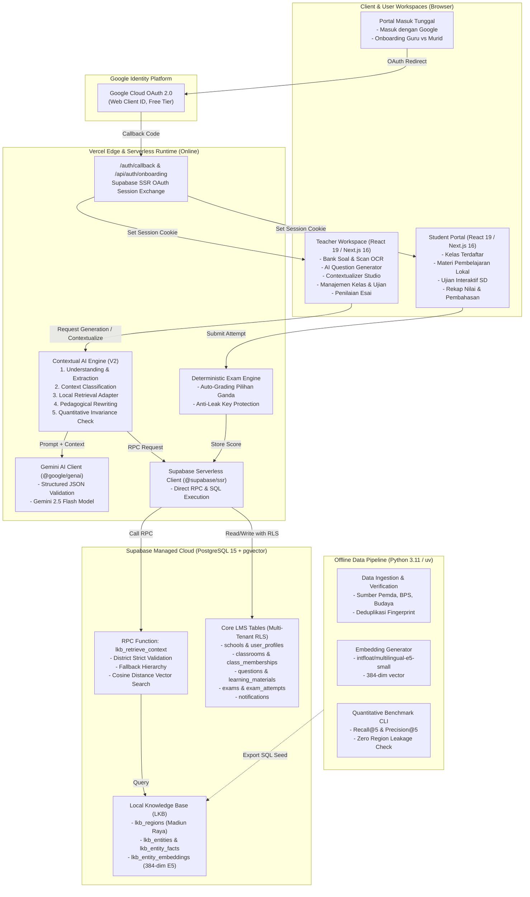

# ARSITEKTUR FINAL SISTEM PAHAMI V2

Dokumen ini mendokumentasikan arsitektur teknis lengkap aplikasi **PAHAMI V2**, platform pembelajaran kontekstual berbasis AI untuk siswa sekolah dasar di wilayah Karesidenan Madiun.

---

## 1. Ringkasan Eksekutif & Prinsip Desain
PAHAMI V2 dirancang dengan prinsip **GitHub Ponytail** (DietrichGebert/ponytail):
1. **Zero-Overengineering**: Tidak ada microservices, broker antrean eksternal (Kafka/RabbitMQ), Redis caching server, maupun container FastAPI/Cloud Run permanen yang membebani biaya.
2. **Serverless-First**: Seluruh frontend dan backend berjalan di atas Next.js 16 (App Router + Turbopack) yang dihosting pada platform Vercel Serverless Edge & Node.js.
3. **Pemisahan Jelas Online vs Offline**:
   - **Online Runtime**: Next.js Server Actions + Route Handlers berkomunikasi langsung ke Supabase PostgreSQL (termasuk RPC `lkb_retrieve_context`) dan Google Gemini 2.5 Flash API.
   - **Offline Tooling**: Pipeline Python (`uv`, `pytest`, `pydantic`, `torch`, `transformers`) digunakan khusus di laptop pengembang untuk data crawling, ekstraksi entitas, normalisasi, dan pembuatan embedding awal.

---

## 2. Diagram Arsitektur Sistem (Mermaid)

---

## 3. Komponen Detail dan Tanggung Jawab Modul

### 3.1 Frontend & User Experience
- **Framework**: Next.js 16.3.5 dengan React 19 dan TailwindCSS v4.
- **Navigasi Global (`components/layout/global-controls.tsx`)**:
  - Menu kontrol atas persisten: Dropdown Sekolah Aktif, Notifikasi, Pengaturan Workspace Guru, dan Profil Pengguna.
  - Dukungan touch device dan desktop tanpa glitch hover.
- **Workspace Guru (`app/teacher/`)**:
  - Dashboard: Menampilkan rekapitulasi sekolah aktif, kelas, materi, dan ujian.
  - Bank Soal (`app/teacher/questions/`): Pembuatan soal manual, AI generator via Gemini, scan foto naskah soal, dan studio kontekstualisasi lokal.
  - Modul Ujian & Evaluasi (`app/teacher/examinations/`): Penjadwalan ujian, pemilihan naskah soal, penilaian jawaban esai, dan rilis pembahasan nilai.
- **Portal Murid (`app/student/`)**:
  - Antarmuka ramah anak SD dengan tipografi jelas dan tombol berukuran proporsional.
  - Pengerjaan ujian online interaktif (`/student/examinations/[id]/session`) dengan auto-save jawaban dan timer otomatis.

### 3.2 Backend Serverless Services (Vercel)
- **Supabase SSR Clients (`lib/supabase/client.ts` & `lib/supabase/server.ts`)**:
  - Pengelolaan session cookie yang aman via `@supabase/ssr` sesuai konvensi Next.js 16 Server Components dan Server Actions.
  - Client retrieval tanpa cookie (`createLkbClient`) yang aman digunakan di lingkungan serverless background maupun route handler.
- **Contextual AI Engine (`lib/context-engine/`)**:
  1. *Entity Extraction*: Mengidentifikasi variabel umum (misal: "beras", "pasar kota", "tarian daerah").
  2. *Retrieval Adapter (`retrieval-adapter.ts`)*: Memanggil RPC `lkb_retrieve_context` dengan filter `region_id`, `category`, dan `limit`.
  3. *Invariance Guarantee*: Memastikan besaran matematis (misal perkalian $20 \times 12.000$) tidak berubah selama penulisan ulang soal matematika.
  4. *Teacher In-the-Loop*: Guru selalu memiliki kendali penuh untuk meninjau dan menyetujui versi kontekstual sebelum soal dipublikasikan.
- **Deterministic Exam Engine (`lib/db/repository.ts`)**:
  - Penilaian pilihan ganda dilakukan di backend (kunci jawaban tidak pernah dikirim ke browser siswa sebelum ujian selesai dipublikasikan).
  - Skor esai ditinjau dan divalidasi oleh guru sebelum digabungkan menjadi nilai akhir komposit.

### 3.3 Database & Penyimpanan (Supabase Managed PostgreSQL)
- **Local Knowledge Base Schema (`20260923140000_local_knowledge.sql`)**:
  - Master data wilayah administratif 6 kabupaten/kota Karesidenan Madiun beserta 25 kecamatan.
  - Indeks vektor `ivfflat` / HNSW pada kolom `embedding vector(384)` untuk semantic search opsional.
  - Fungsi RPC `lkb_retrieve_context` dengan validasi ketat district untuk mencegah kebocoran data (*zero region leakage*).
- **Core LMS Schema (`20260924000000_pahami_core_schema.sql`)**:
  - Multi-tenant school isolation: Semua entitas (kelas, soal, materi, ujian) memiliki relasi asing ke `schools(id)`.
  - Row Level Security (RLS) aktif di seluruh 9 tabel utama untuk menjamin murid tidak dapat membaca kunci jawaban atau jawaban murid lain.

### 3.4 Pipeline Python Offline (`data-pipeline/`)
- **Tujuan**: Pemeliharaan data skala besar secara offline.
- **Teknologi**: Python 3.11, `uv`, `pydantic`, `torch`, `transformers` (`intfloat/multilingual-e5-small`).
- **Fitur**:
  - Ingestion dan verifikasi sumber data primer (BPS, Dinas Kebudayaan, Pemda).
  - Uji kuantitatif benchmark 30 pertanyaan standar pedagogis dan trick cases (`cli.py --evaluate`).
  - Generator file SQL seed otomatis untuk pembaruan database tanpa perlu menjalankan server Python permanen.

---

## 4. Alur Autentikasi dan Otorisasi (Google OAuth Only)
1. Pengguna membuka `/login` dan menekan tombol **"Masuk dengan Google"**.
2. Supabase Auth mengarahkan browser ke Google OAuth 2.0 Consent Screen.
3. Setelah persetujuan pengguna, Google me-redirect browser kembali ke `/auth/callback?code=...`.
4. Route handler `/auth/callback` menukarkan auth code menjadi session JWT di Supabase SSR cookie.
5. Handler memeriksa tabel `user_profiles`:
   - Jika pengguna baru (belum memiliki profil), diarahkan ke `/auth/onboarding`.
   - Jika Guru terverifikasi, diarahkan ke `/teacher/dashboard`.
   - Jika Murid terdaftar, diarahkan ke `/student/dashboard`.
6. Di halaman `/auth/onboarding`:
   - **Guru**: Wajib memasukkan kode verifikasi pendidik (`GURU-PAHAMI-2026`) dan memilih sekolah penugasan.
   - **Murid**: Wajib memasukkan kode kelas unik dari guru (contoh: `PNR-5A`), yang secara otomatis menetapkan `school_id` sesuai kelas tersebut tanpa celah pemalsuan ID sekolah.

---

## 5. Ringkasan Keamanan & Privasi
- **Zero API Key Leakage**: Tidak ada `GEMINI_API_KEY` atau `SUPABASE_SERVICE_ROLE_KEY` yang terekspos ke bundle JavaScript browser pengguna.
- **Perlindungan Data Anak SD**: Profil siswa hanya menyimpan nama dan kode keanggotaan kelas, tanpa mengumpulkan data pribadi sensitif (nomor telepon, alamat rumah, atau data finansial).
- **Graceful Degradation**: Jika kuota Gemini habis atau koneksi AI bermasalah, guru tetap dapat membuat soal manual, menggunakan bank soal yang sudah ada, mengelola kelas, dan melaksanakan ujian seperti biasa.
