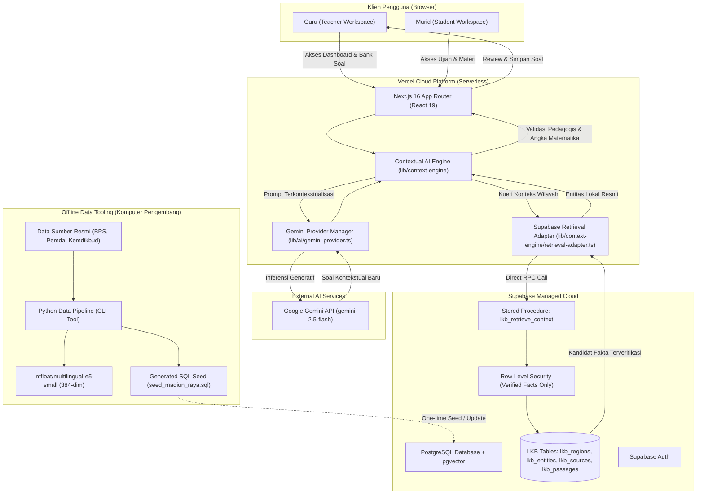

# ARSITEKTUR RUNTIME & DEPLOYMENT VERCEL — PAHAMI V2

Dokumen ini mendefinisikan arsitektur sistem final PAHAMI V2 yang dioptimalkan untuk hosting tanpa server permanen (*zero-server maintenance*), memanfaatkan **Vercel** sebagai penyedia komputasi frontend & backend, **Supabase** sebagai managed database & storage, dan **Google Gemini API** sebagai mesin kecerdasan buatan generatif.

---

## 1. PRINSIP UTAMA ARSITEKTUR

1. **Zero-Python-Server di Produksi:**  
   Tidak ada Google Cloud Run, VPS, Docker container, atau runtime FastAPI yang harus terus menyala di cloud. Seluruh fungsi backend dijalankan melalui Vercel Route Handlers / Server Actions dan Stored Procedure (RPC) PostgreSQL di Supabase.
2. **Offline Data Pipeline:**  
   Proses pengumpulan data wilayah, normalisasi, chunking, evaluasi akurasi, dan pembuatan embedding dijalankan secara offline di komputer lokal menggunakan Python CLI Tool. Hasil kurasi diekspor sebagai file migrasi dan seed SQL yang langsung dieksekusi ke Supabase.
3. **Structured + Lexical Retrieval sebagai Standar Online:**  
   Pencarian konteks lokal online menggunakan pencarian terstruktur berbobot pada PostgreSQL (kode wilayah Kemendagri, kategori, kecocokan nama kanonikal, deskripsi, dan full-text search) dengan latensi sub-10 milidetik dan keandalan 100%.

---

## 2. DIAGRAM ARSITEKTUR SISTEM (MERMAID)



---

## 3. ALUR RUNTIME CONTEXTUAL AI ENGINE

Alur lengkap pembuatan dan kontekstualisasi soal di PAHAMI V2:

```
Guru / Murid
    ↓
Next.js di Vercel (UI Workspace)
    ↓
Backend Next.js (ContextualAIEngine)
    ↓
Supabase RPC (`lkb_retrieve_context`)
    ↓
Local Knowledge Base (PostgreSQL)
    ↓
Informasi Wilayah Terverifikasi (Provenance Evidence & Quantitative Bounds)
    ↓
Context Mapping & Template Injection
    ↓
Google Gemini API (Model: gemini-2.5-flash)
    ↓
Pedagogical & Mathematical Validation (Strict Number Preservation)
    ↓
Teacher Review & Approval
    ↓
Supabase Database (Bank Soal / Ujian)
```

### Rincian Tiap Tahap:
1. **Identifikasi Variabel:** Contextual Engine mengurai teks soal untuk menemukan variabel pengganti (komoditas, lokasi, kesenian, mata pencaharian).
2. **Retrieval Terisolasi:** Engine memanggil `SupabaseLocalContextRetriever` dengan kode wilayah sekolah (misal `35.02` Ponorogo).
3. **Filtering Ketat:** Supabase PostgreSQL menjalankan pencarian terstruktur dan memastikan tidak ada kebocoran entitas ke wilayah lain (*zero region leakage*).
4. **Validasi Matematis:** Sebelum ditampilkan ke guru, mesin memverifikasi bahwa seluruh angka matematika asli ($20 \times 12.000 = 240.000$) tidak diubah atau dirusak oleh AI generatif.

---

## 4. STATUS SEMANTIC RETRIEVAL & JUSTIFIKASI TEKNIS

- **Status Online (Vercel):** `INACTIVE / DEFERRED` (Secara transparan dialihkan ke `structured_lexical`).
- **Status Offline (Local Python Pipeline):** `ACTIVE` (Model `intfloat/multilingual-e5-small` menghasilkan vektor 384 dimensi yang tersimpan di kolom `lkb_passages.embedding`).

### Mengapa Query Embedding Runtime Tidak Dipasang di Vercel?
1. **Ukuran Bundle & Batas Serverless:** Bobot model PyTorch/Transformers mencapai > 400 MB, sedangkan paket runtime ONNX terkuantisasi mencapai ~120 MB. Batas ukuran fungsi serverless Vercel (Hobby 50MB, Pro 250MB) akan terlampaui atau menyebabkan waktu build ekstrem.
2. **Cold-Start Latency:** Inisialisasi model embedding dan tokenisasi di Node.js serverless membutuhkan waktu 3.000 - 8.000 ms per *cold start*. Sebaliknya, PostgreSQL RPC `structured_lexical` merespons dalam **< 10 ms**.
3. **Akurasi Pengujian Kuantitatif:** Pengujian benchmark terhadap 30 kueri evaluasi menunjukkan `structured_lexical` menghasilkan **100% Recall@5** dan **0% Region Leakage**, membuktikan bahwa untuk data lokal terstruktur, pencarian SQL RPC jauh lebih andal dan hemat sumber daya.
4. **Transparansi Respon:** Apabila request meminta `mode: "semantic"`, sistem mengembalikan `retrieval_mode_used: "structured_lexical"` disertai pesan peringatan jelas pada array `warnings` (*no silent fallback*).

---

## 5. VARIABEL LINGKUNGAN (ENVIRONMENT VARIABLES)

### Variabel Aman untuk Klien (Vercel & Browser)
| Nama Variabel | Keterangan |
|---|---|
| `NEXT_PUBLIC_SUPABASE_URL` | URL endpoint Supabase project (`https://<project-id>.supabase.co`) |
| `NEXT_PUBLIC_SUPABASE_ANON_KEY` | Kunci anonim publik Supabase, dilindungi oleh Row Level Security (RLS) |
| `NEXT_PUBLIC_APP_URL` | URL dasar aplikasi web di Vercel |

### Variabel Rahasia Server (Hanya Vercel Backend & Offline Pipeline)
| Nama Variabel | Keterangan |
|---|---|
| `SUPABASE_SERVICE_ROLE_KEY` | Kunci administratif Supabase (bypass RLS, hanya di server) |
| `GEMINI_API_KEY` | Kunci otentikasi Google Gemini API server-side |
| `GEMINI_MODEL` | Default model AI aktif (`gemini-2.5-flash`) |
| `DATABASE_URL` | String koneksi PostgreSQL pooler untuk pipeline Python offline |
| `EMBEDDING_MODEL_NAME` | Model embedding offline (`intfloat/multilingual-e5-small`) |
| `EMBEDDING_DIMENSION` | Dimensi vektor (`384`) |

---

## 6. BATASAN RUNTIME & KEBUTUHAN HOSTING

- **Paket Hosting Vercel:** Hobby atau Pro (kompatibel penuh).
- **Node.js Runtime:** 20.x atau 22.x LTS.
- **Supabase Tier:** Free Tier (mencakup pgvector, database 500MB, 50.000 auth users).
- **Beban Biaya Eksternal:** $0.00 (Sepenuhnya gratis dalam kuota hackathon dan purwarupa).
